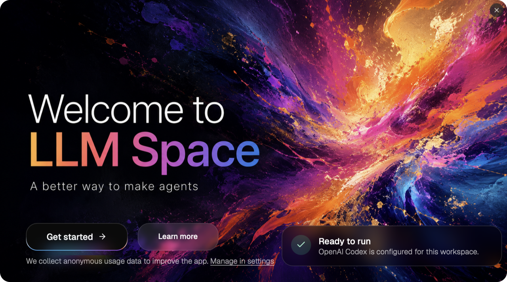
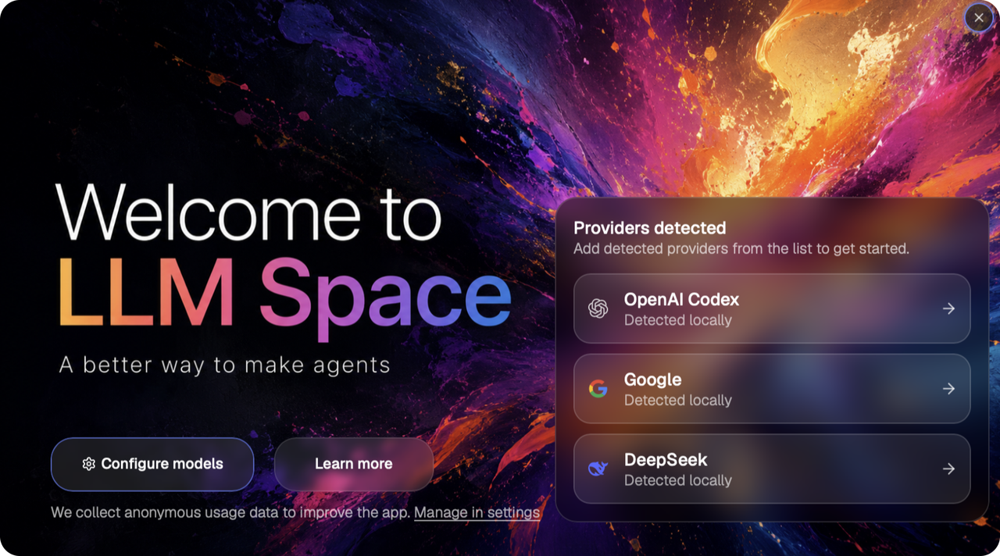
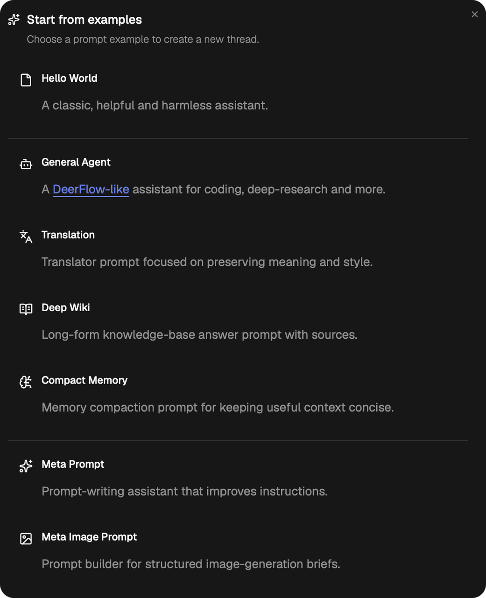
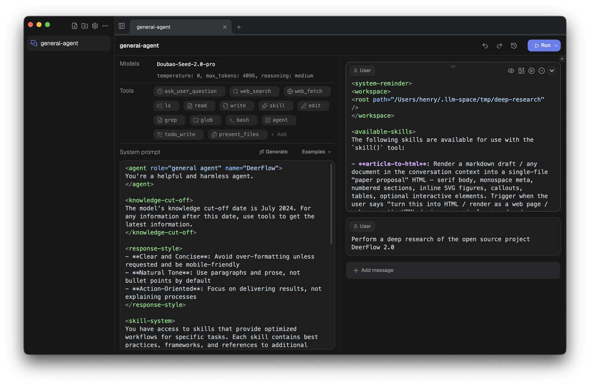
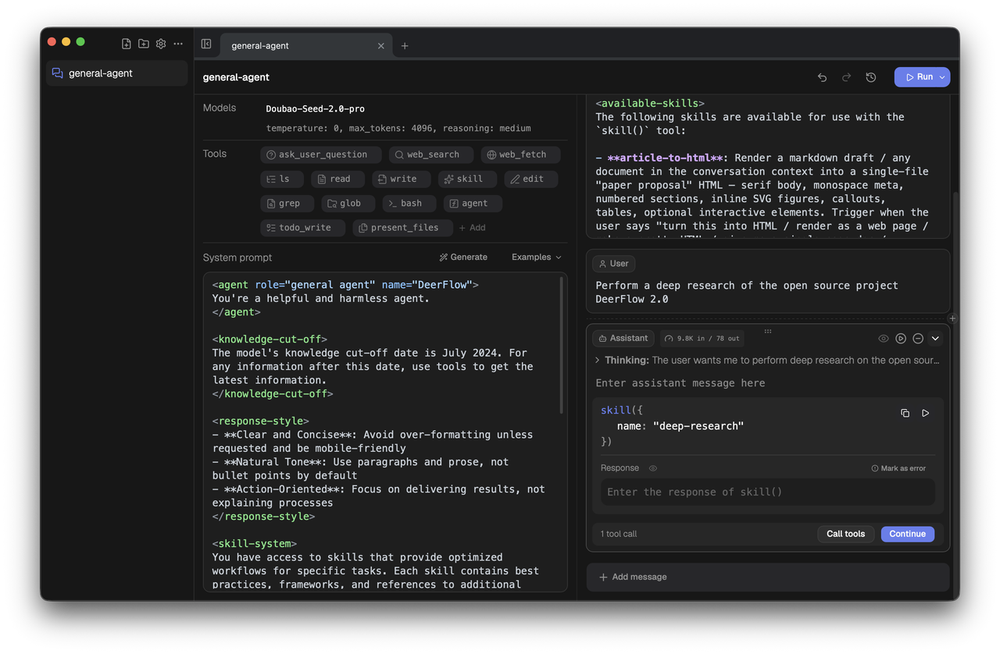
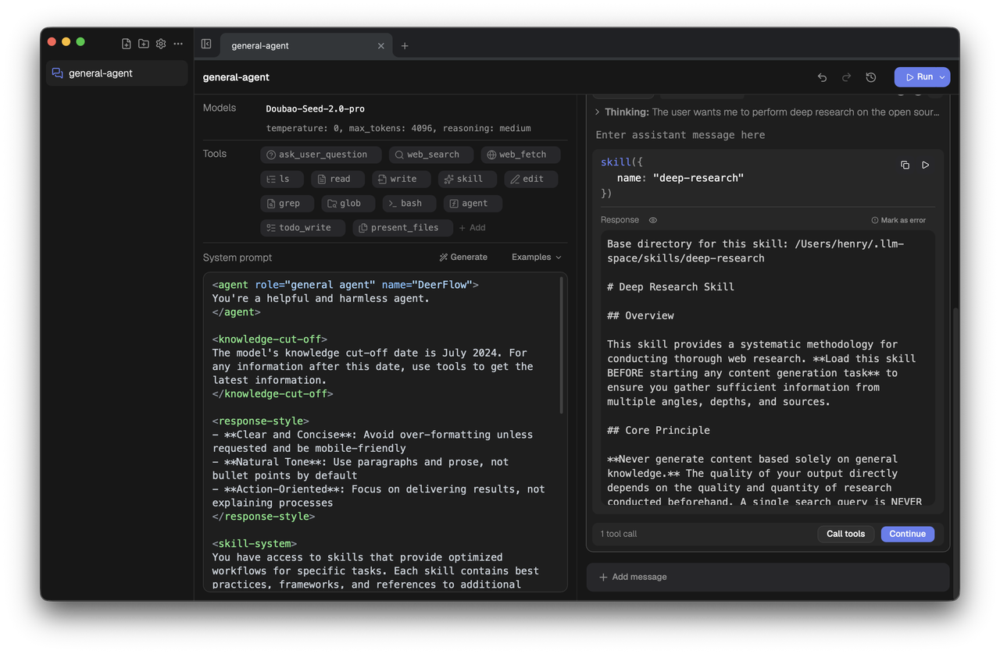
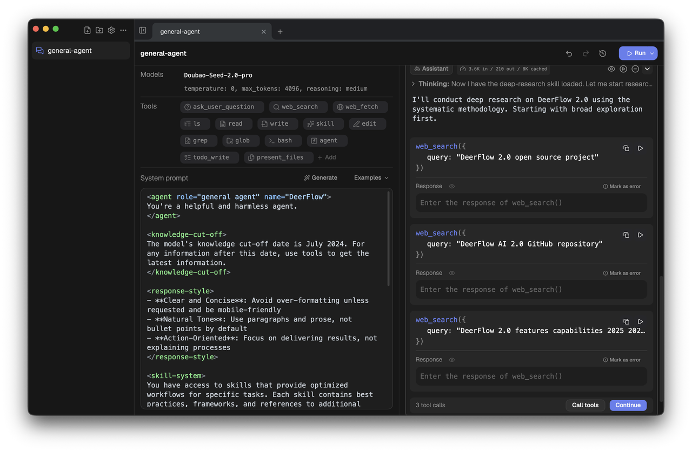
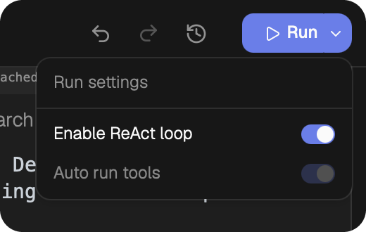
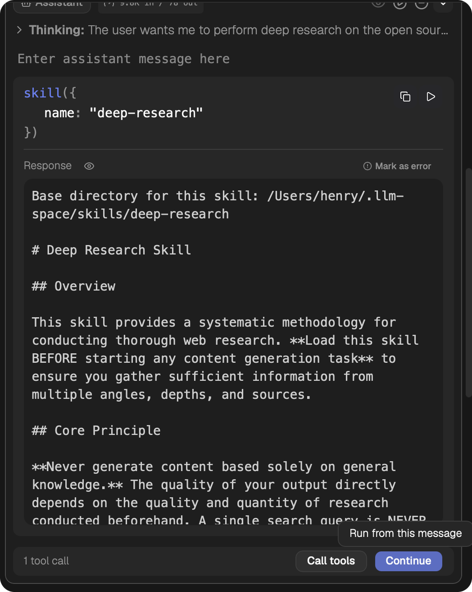

[English](./get-started.md) | 中文

---

# LLM Space 4 快速开始

欢迎使用 LLM Space 4。

LLM Space 诞生于 2023 年 3 月，目前已经完成第 3 次大版本升级。它是一款专门为 Agent 开发者、产品经理和测试工程师设计的桌面端开发工具，可以用来实验 Agent 新想法，观测、调试和评测 Agent。

LLM Space 是开源产品。如果它对你有帮助，欢迎到 [GitHub 开源仓库](https://github.com/deer-flow/llm-space) Star 支持。



# 常用文档和链接

- [GitHub 开源仓库](https://github.com/deer-flow/llm-space)：欢迎 Star，这是对项目最大的帮助。
- [支持与捐助](https://my.feishu.cn/wiki/OvLBwVuSkiCR1ik5wGEcBXZfnye)：喜欢的话，可以用爱发电。
- [Harness 系列课程](https://my.feishu.cn/wiki/L082wubkdie8uMkRUjgceKYQnIe)：学习 Agent 开发、调试和评测的系统方法。

# 下载、安装和更新

从项目发布渠道下载适合你系统的安装包，按桌面应用的常规方式安装即可。后续更新可以覆盖安装；如果你需要保留已有配置和 Thread，确保不要删除本机的 LLM Space 数据目录。

LLM Space 的用户数据默认保存在：

```text
~/.llm-space
```

其中 `workspace/` 保存 Thread 文件，`settings/` 保存模型、MCP、窗口等配置。更多存储格式说明见 [核心概念](./core-concepts.zh-CN.md)。

# 快速配置模型

首次打开 LLM Space 时，你会看到欢迎向导。系统会读取当前环境变量中可能存在的 API Key，并自动推荐可用的 Model Provider。



如果右侧出现 `Providers detected` 列表，单击任意提供商即可快速添加。添加成功后，欢迎页会显示 `Ready to run`，这表示至少有一个模型已经可以在当前工作区使用。


如果没有看到自动检测结果，也可以单击 `Configure models` 进入 Model settings 对话框，手动添加 Provider、API Key、Base URL 和模型列表。之后也可以随时从菜单中的 Settings 打开模型设置，继续添加或修改更多模型提供商，详见 [设置](./settings.zh-CN.md)。

配置好模型后，单击 `Get started` 进入主界面。

# 玩转你的第一个 Thread

Thread 可以理解为一个 Agent 的完整上下文。它包含模型、模型参数、工具、系统提示词和消息列表，是一次可保存、可复制、可调试的会话实验。

常见 Thread 内容包括：

| 内容 | 说明 |
| --- | --- |
| Models | 当前 Thread 使用的模型和 Provider。 |
| Model parameters | 例如 `temperature`、`max_tokens`、`reasoning_effort` 等运行参数。 |
| Tools | Agent 可以调用的工具，例如内置工具、Custom Function Tool、MCP 工具。 |
| System Prompt | Agent 的全局行为设定。 |
| Message List | User / Assistant 消息，以及 Assistant 发起的 Tool Calls。 |

更完整的术语说明见 [核心概念](./core-concepts.zh-CN.md)。

## 从示例创建 Thread

在主界面中单击 `Start from Example`，选择一个示例来创建新 Thread。



这里选择 `General Agent` 作为第一个 Thread。它内置了一组常用工具和系统提示词，适合快速体验 Agent 调试流程。



## 运行 Thread

单击右上角的 `Run` 按钮即可执行当前 Thread。



运行后，右侧会出现 Assistant 消息。上图中的 Assistant 消息包含一次对 `skill()` 工具的调用。因为 `skill()` 是 LLM Space 内置工具，你可以直接单击工具卡片右侧的播放按钮，或单击底部的 `Call tools` 执行工具并获得响应。



工具返回结果后，单击 `Continue` 即可继续下一轮次，也就是继续一次 ReAct Loop。

## 调试多个 Tool Calls

继续运行后，你可能会看到一个 Assistant Message 中包含多个工具调用。



这类消息可以有两种调试方式：

- 单击 `Call tools`，一次性并行执行所有待运行的 Tool Calls。
- 单独点击某个工具调用卡片的播放按钮，只执行其中一个 Tool Call。

这适合观察模型为什么选择某个工具、传入了什么参数，以及工具返回结果会如何影响后续推理。

## 启用 ReAct Loop

除了单步调试，你也可以让 LLM Space 自动继续 ReAct Loop。

单击右上方 `Run` 按钮右侧的下拉按钮，打开运行设置，然后启用 `Enable ReAct loop`。



启用后，找到想要作为起点的 User Message 或 Assistant Message，单击对应位置的 `Continue` 或 `Run from this message`，LLM Space 会从该消息开始自动运行后续 ReAct Loop，直到完成或遇到需要人工处理的步骤。



# 继续调试你的 Agent

LLM Space 的核心价值不只是“跑通一次对话”，而是让你能直接修改 Agent 的运行现场：

- 修改模型和模型参数，比较不同模型的行为。
- 修改 Tools，观察工具列表变化如何影响模型决策。
- 修改 System Prompt，快速迭代 Agent 行为。
- 修改 User Message 和 Assistant Message，复现实验条件。
- 修改 Tool Call 参数或响应，验证异常、边界情况和不同工具结果。
- 使用可复用的评测 Rubric、逐项评分和明确的分数差值对比运行历史，判断哪个版本更好。

这就是 LLM Space 中的 Agent 调试：把一次 Agent 运行拆成可观察、可编辑、可重放的上下文。


---


完成这篇快速开始后，可以继续阅读：

- [核心概念](./core-concepts.zh-CN.md)
- [变量与模板](./variables-and-templates.zh-CN.md)
- [对话压缩](./compaction.zh-CN.md)
- [分享 Thread](./sharing.zh-CN.md)
- [生成项目](./generating-projects.zh-CN.md)
- [界面布局](./ui-layout.zh-CN.md)
- [设置](./settings.zh-CN.md)
- [常用快捷键](./shortcut-keys.zh-CN.md)
