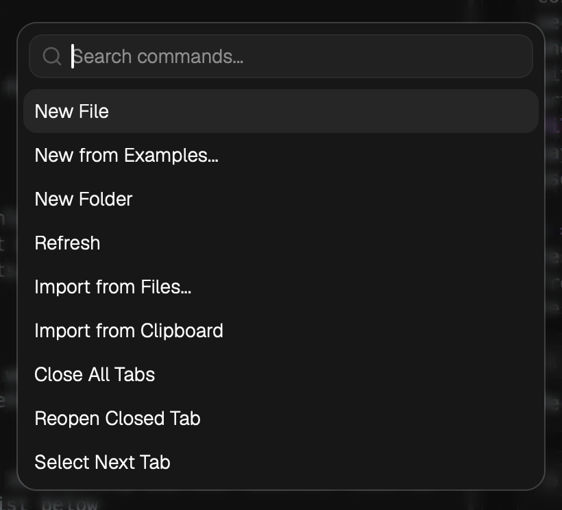

English | [中文](./shortcut-keys.zh-CN.md)

---

# 快捷键

LLM Space 支持桌面菜单和 Thread 编辑器中的快捷键。本文档示例使用 macOS 的 `Command` 键；在 Windows / Linux 上，对应的键通常是 `Ctrl`。

# 菜单快捷键

这些快捷键来自桌面应用程序菜单。

| 菜单 | 操作 | macOS 快捷键 | Windows / Linux |
| --- | --- | --- | --- |
| LLM Space | 打开设置 | `Command + ,` | `Ctrl + ,` |
| LLM Space | 隐藏应用 | `Command + H` | `Ctrl + H` |
| LLM Space | 隐藏其他应用 | `Command + Shift + H` | `Ctrl + Shift + H` |
| LLM Space | 退出应用 | `Command + Q` | `Ctrl + Q` |
| 文件 | 新建 Thread 文件 | `Command + N` | `Ctrl + N` |
| 文件 | 新建文件夹 | `Command + Shift + N` | `Ctrl + Shift + N` |
| 文件 | 关闭当前标签页 | `Command + W` | `Ctrl + W` |
| 文件 | 重新打开已关闭的标签页 | `Command + Shift + T` | `Ctrl + Shift + T` |
| 视图 | 打开命令面板 | `Command + Shift + P` | `Ctrl + Shift + P` |
| 视图 | 切换左侧边栏 | `Command + B` | `Ctrl + B` |
| 视图 | 重新加载应用 | `Command + Shift + R` | `Ctrl + Shift + R` |
| 视图 | 放大 | `Command + +` | `Ctrl + +` |
| 视图 | 缩小 | `Command + -` | `Ctrl + -` |
| 视图 | 重置缩放 | `Command + 0` | `Ctrl + 0` |
| 窗口 | 选择上一个标签页 | `Command + Option + Left` | `Ctrl + Alt + Left` |
| 窗口 | 选择下一个标签页 | `Command + Option + Right` | `Ctrl + Alt + Right` |
| 窗口 | 切换全屏 | `Command + Shift + F` | `Ctrl + Shift + F` |

# 命令面板

`Command + Shift + P` 打开命令面板。您可以在此搜索并运行应用命令，例如打开设置、切换侧边栏、导入文件或关闭标签页。

# Thread 运行快捷键

Thread 页面支持快速运行当前 Thread 或从特定消息继续运行。

| 操作 | macOS 快捷键 | Windows / Linux | 行为 |
| --- | --- | --- | --- |
| 运行 / 停止当前 Thread | `Command + Enter` | `Ctrl + Enter` | 如果没有聚焦任何 Message 编辑器，则从最后一条消息开始运行。如果已有运行正在进行，则停止当前运行。 |
| 从当前 Message 运行 | `Command + Enter` | `Ctrl + Enter` | 如果聚焦了 Message 编辑器，则从该消息开始运行。 |
| 从当前 Message 运行 | `Command + R` | `Ctrl + R` | 如果聚焦了 Message 编辑器，则从该消息开始运行。如果没有聚焦任何 Message，则从最后一条消息开始运行。 |
| 打开快速命令入口 | `Command + P` | `Ctrl + P` | 用于快速触发常见操作。 |

`Command + P` 打开命令搜索入口，您可以输入以查找操作，例如创建文件、导入内容、关闭标签页或切换标签页。

## 当 Message 处于聚焦状态时

当光标位于用户 Message 或助手 Message 编辑器内时，运行快捷键将以该 Message 作为起点。这等同于在该 Message 上使用 `从此消息运行` / `继续`。

这对于调试中间步骤非常有用：编辑用户 Message、助手 Message 或工具调用结果，然后从该点继续运行。

## 当没有 Message 处于聚焦状态时

当焦点不在任何 Message 编辑器内时，运行快捷键将从最后一条消息开始。这等同于点击 Thread 右上角的 `运行`。

如果当前 Thread 已在运行中，再次触发运行快捷键将停止当前运行。

# 编辑器快捷键

某些输入框和编辑器会优先处理自己的快捷键。例如，剪切、复制、粘贴、撤销和重做在文本编辑区域遵循操作系统的默认行为。

如果快捷键未触发全局操作，请首先检查焦点是否位于输入框、CodeMirror 编辑器或对话框表单内。