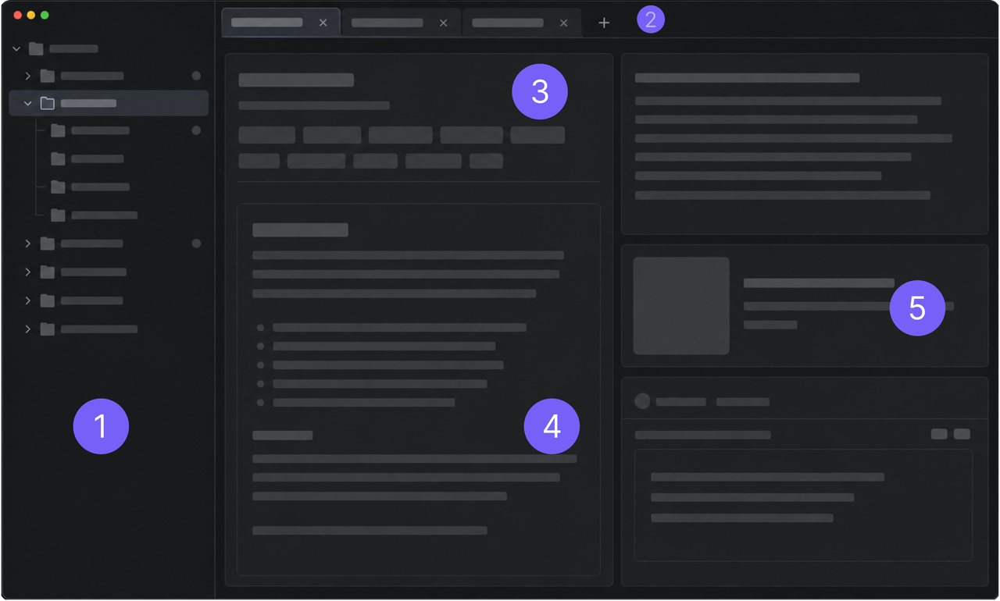

English | [中文](./ui-layout.zh-CN.md)

---

# 界面布局

LLM Space 主界面围绕 Thread 的编辑、运行和调试进行组织。左侧管理工作区文件，中间区域包含当前活动的 Thread 编辑器，右侧显示运行输出、预览和调试上下文。

| 编号 | 区域 | 描述 |
| --- | --- | --- |
| 1 | 工作区 | 工作区文件树。显示 `workspace/` 下的目录和 Thread JSON 文件，用于创建、打开、复制、移动、删除和组织 Thread。 |
| 2 | Thread 标签页 | 已打开的 Thread 标签页。使用这些标签页可在多个 Thread 之间切换，或在新标签页中打开更多实验。 |
| 3 | Thread 设置 | 当前 Thread 的运行时设置。此区域通常包括标题、模型选择、运行参数、工具及相关实验设置。 |
| 4 | 系统提示词 | 在此处编辑系统提示词，以调整模型行为和输出。 |
| 5 | 消息 | 对话编辑和运行区域。显示用户/助手消息、模型输出、工具调用记录以及运行期间的流式响应。 |

核心思想很简单：在左侧选择文件，在中间编辑并运行 Thread，在右侧检查证据和调试上下文。